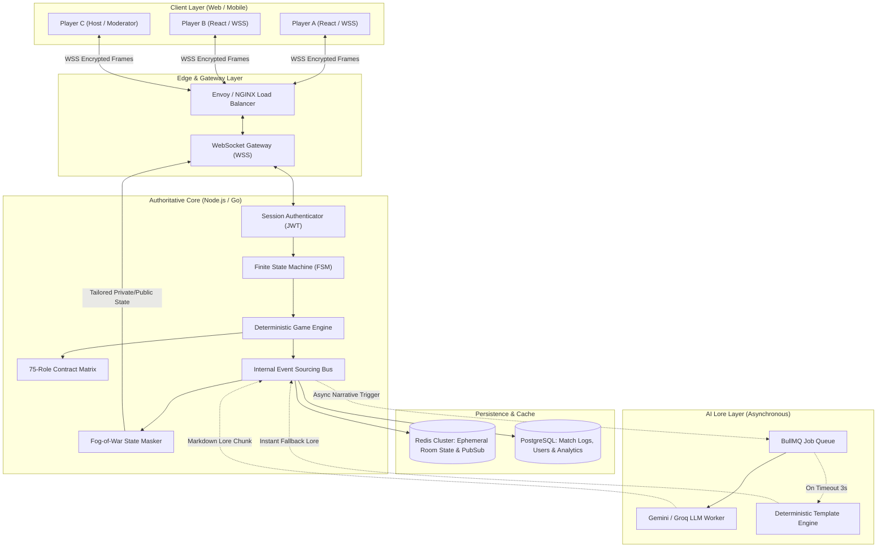
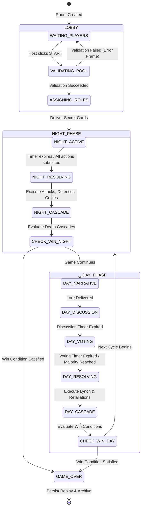
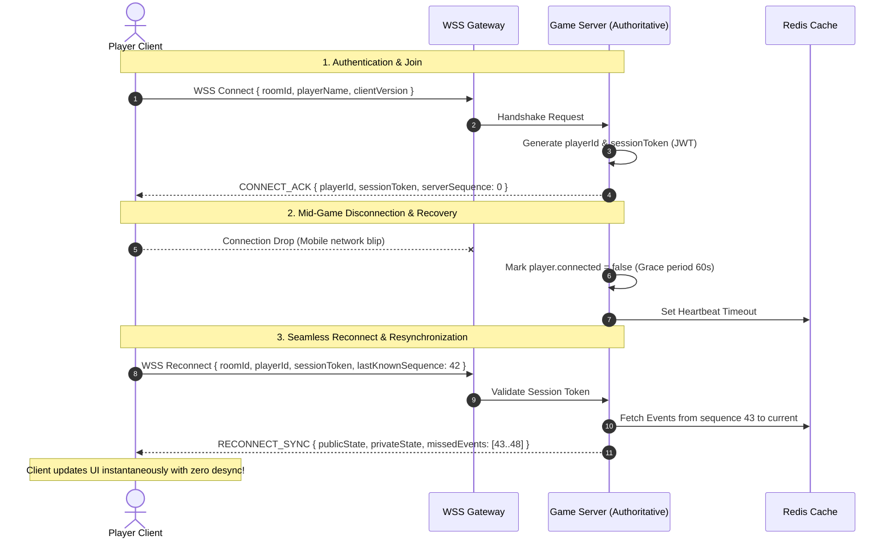
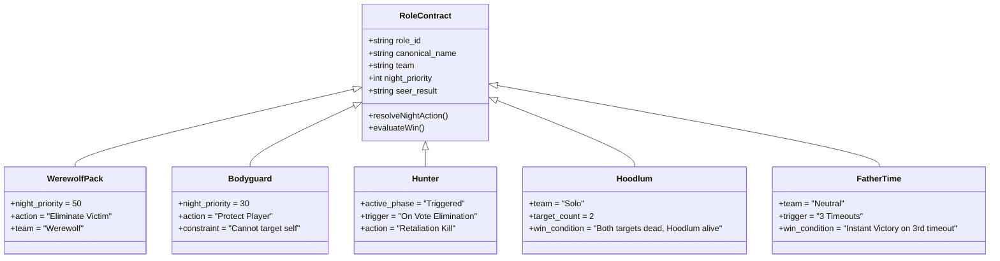
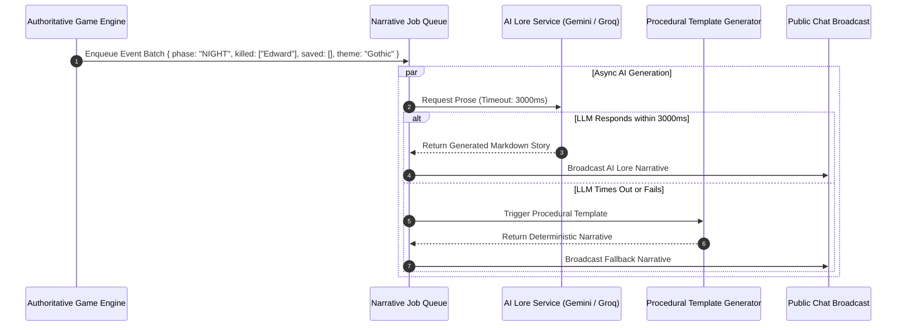
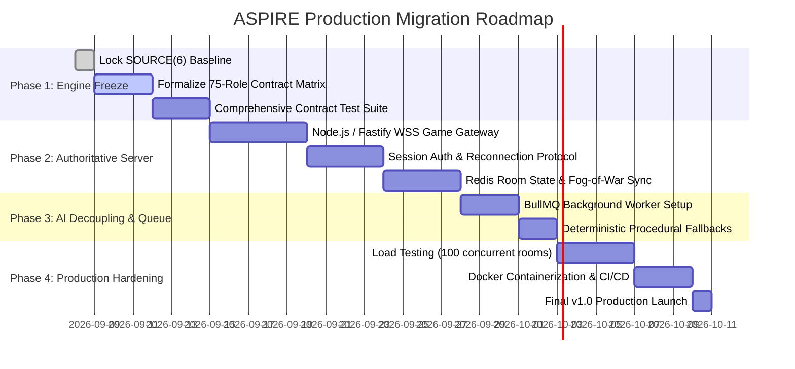

# ASPIRE: WEREWOLF — Architecture Specification v1.0
## Production-Grade Social Deduction Engine & Narrative Subsystem

> **System Axiom**: *"Client requests action. Server resolves truth. Engine produces facts. AI crafts the lore."*

---

## 1. Architectural Overview & System Topology

The transition of ASPIRE from a peer-to-peer prototype (SOURCE 6) to an enterprise-ready production platform requires decoupling client presentation from game state authority. The public MQTT broker is replaced by a **Dedicated Authoritative Game Server Cluster** maintaining single-source-of-truth state.



---

## 2. Authoritative Finite State Machine (FSM) & Lifecycle

The game lifecycle is strictly linear and authoritative. All transitions occur on the server upon event triggers or timer expirations.



---

## 3. Append-Only Event Sourcing Model

Every mutation within the engine is represented by an immutable, cryptographically signed `GameEvent`. State is derived deterministically from the history of events.

### 3.1 Event Schema Definition
```typescript
export type GameEventType =
  | "ROOM_CREATED"
  | "PLAYER_CONNECTED"
  | "PLAYER_DISCONNECTED"
  | "PLAYER_RECONNECTED"
  | "CONFIG_UPDATED"
  | "GAME_STARTED"
  | "ROLES_ASSIGNED"
  | "PHASE_TRANSITIONED"
  | "ACTION_SUBMITTED"
  | "ACTION_RESOLVED"
  | "DEATH_CASCADE_TRIGGERED"
  | "ROLE_TRANSFORMED"
  | "VOTE_CAST"
  | "VOTE_RESOLVED"
  | "TIMEOUT_TRIGGERED"
  | "WIN_CONDITION_MET"
  | "NARRATIVE_PUBLISHED";

export interface GameEvent<T = any> {
  eventId: string;           // UUIDv7 (Monotonically increasing time-order)
  roomId: string;            // Alphanumeric Room Code
  sequence: number;          // Global sequential tick counter (0, 1, 2, ...)
  timestamp: number;         // Unix epoch in milliseconds
  type: GameEventType;
  actorId?: string;          // Player ID executing action (if applicable)
  payload: T;                // Event-specific factual data
  serverSignature: string;   // HMAC-SHA256(eventId + sequence + payload, SECRET)
}
```

### 3.2 Canonical Game Reducer Pattern
```typescript
export function gameReducer(state: GameState, event: GameEvent): GameState {
  switch (event.type) {
    case "ROLES_ASSIGNED":
      return applyRoleAssignments(state, event.payload);
    case "ACTION_RESOLVED":
      return applyNightResolutions(state, event.payload);
    case "DEATH_CASCADE_TRIGGERED":
      return applyDeathCascade(state, event.payload);
    case "ROLE_TRANSFORMED":
      return applyRoleTransformation(state, event.payload);
    case "VOTE_RESOLVED":
      return applyVoteResults(state, event.payload);
    case "TIMEOUT_TRIGGERED":
      return { ...state, timeoutCount: state.timeoutCount + 1 };
    default:
      return state;
  }
}
```

---

## 4. Multiplayer Security, Session Auth & Reconnection Protocol

### 4.1 Threat Model & Countermeasures

| Vulnerability | Attack Vector | Authoritative Countermeasure |
| :--- | :--- | :--- |
| **Impersonation** | Spoofing `senderId` in vote or night action | Server assigns secure cryptographically signed `sessionToken` upon join; rejects any frame where `socket.sessionToken.playerId !== payload.actorId`. |
| **Information Leakage** | Sniffing WebSocket packets for secret roles | **Strict Fog-of-War Masking**: Secret roles and wolf chats are partitioned at the server layer. Unprivileged clients receive zero role fields for other players. |
| **Action Exploitation** | Dead players voting or acting out-of-phase | **Server-Side Liveness & Phase Check**: Engine rejects actions from dead, silenced, or non-priority actors. |
| **Replay Attacks** | Resubmitting previously valid packets | Monotonic sequence counters on frames; server discards stale sequence numbers. |

### 4.2 Two-Way Handshake & Reconnection Sequence


---

## 5. 75-Role Contract Ruleset Specification

Rather than fragmented code blocks, all 75 roles operate under an explicit declarative contract.

```typescript
export interface RoleContract {
  role_id: string;
  canonical_name: string;
  team: "Village" | "Werewolf" | "Neutral" | "Vampire" | "Dynamic";
  category: "Village" | "Werewolf" | "Neutral" | "Special" | "Timer" | "Independent";
  seer_result: "Werewolf" | "Villager";
  night_priority: number;
  active_phase: "Night" | "Day" | "Triggered" | "Passive";
  usage_limit: "Nightly" | "Once" | "Passive" | "First Night" | "Varies";
  
  // Execution contracts
  nightActionResolver?: (ctx: ActionContext) => ActionResult;
  voteWeightResolver?: (player: Player) => number;
  deathCascadeTrigger?: (ctx: DeathContext) => CascadeEvent[];
  winConditionEvaluator?: (ctx: WinContext) => WinResult | null;
  transformationTrigger?: (ctx: TriggerContext) => RoleTransformResult | null;
}
```

### 5.1 Authoritative Execution Matrix (Sample Core Archetypes)



---

## 6. Decoupled AI Storyteller Architecture & Deterministic Fallback

The fundamental boundary is maintained: **Engine computes facts, LLM narrates prose**.



### 6.1 Strict Fallback Invariant
If the LLM worker experiences rate limits, network timeouts, or invalid JSON output, the game engine **never freezes**. The deterministic template subsystem takes over with zero latency.

---

## 7. Migration & Engineering Roadmap (SOURCE 6 to v1.0)



---

## 8. v1.0 Definition of Done (DoD) Checklist

- [x] **75 Roles Schema & Registry**: Complete database with 79 abilities.
- [x] **Deterministic Engine**: Action resolution, death cascade, vote weight, transformations.
- [x] **Host-Authoritative Validation**: Base packet validation and spoof rejection.
- [ ] **Dedicated Game Server**: Node.js/Fastify WSS service replacing public MQTT broker.
- [ ] **Cryptographic Session Auth**: JWT handshake with anti-impersonation guarantee.
- [ ] **Stateful Reconnect**: Redis event-log replay for dropped connections.
- [ ] **Automated Role Contract Tests**: Scenario matrix verifying contract constraints across all 75 roles.
- [ ] **Decoupled AI Queue**: Background worker with 3-second timeout and 100% deterministic fallback.
- [ ] **Full Production Deployment**: Dockerized container stack deployed to scalable cloud VPS.
